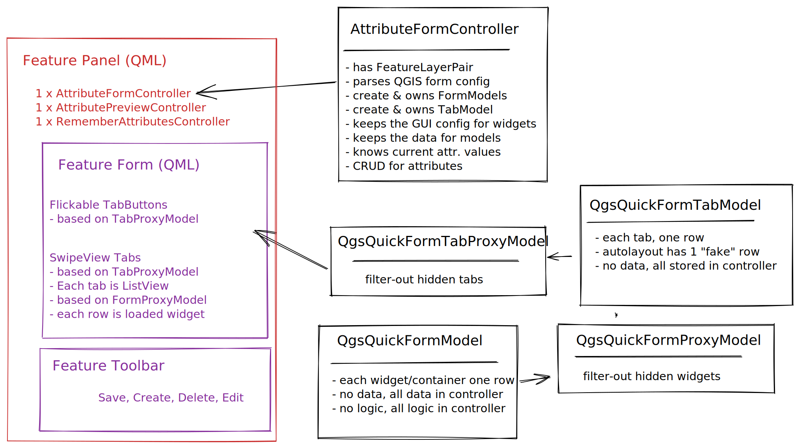
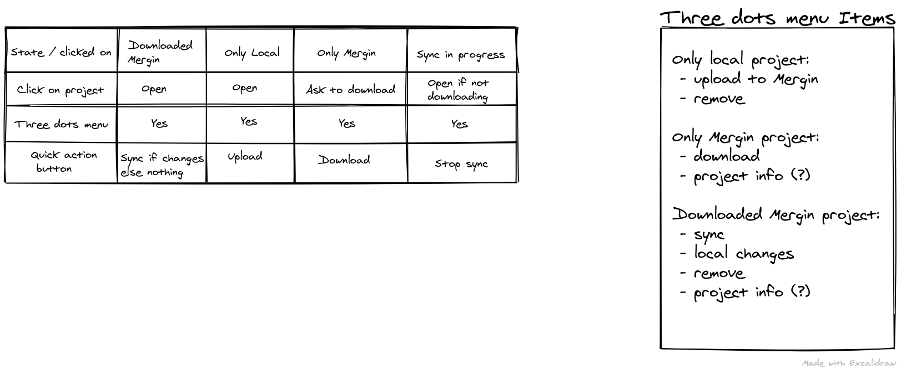
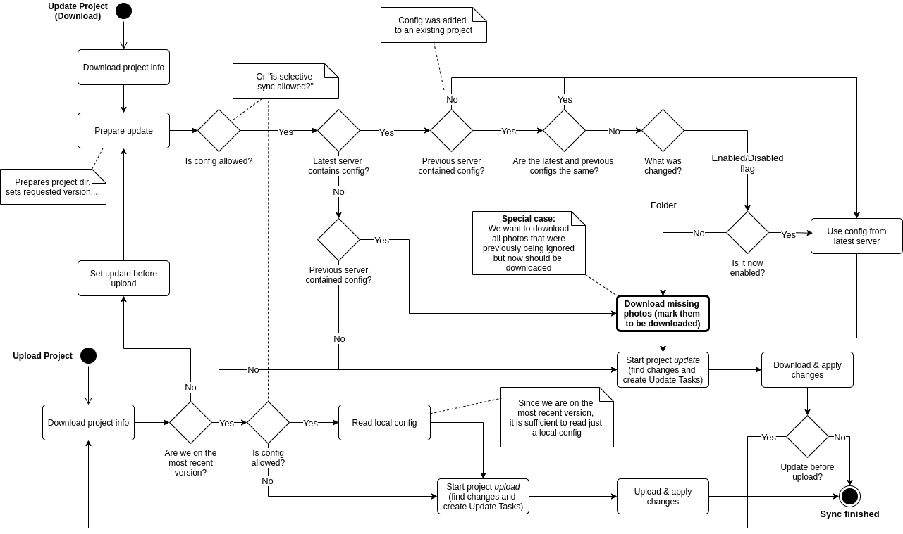

# Code Architecture Docs

For user documentation, please read [merginmaps.com/docs](https://merginmaps.com/docs).

For setup of development environment, please see [INSTALL](../INSTALL.md).

For translations, please see [translation docs](translations.md).

For various how-tos, please see [howto dev docs](howto.md).

## Forms

## (Mergin) Projects

## Projects handling during sync

## Fields in more menu:

## Selective sync behavior:

## Form models:

## Form validation:

## (Android) Legacy folder migration:

