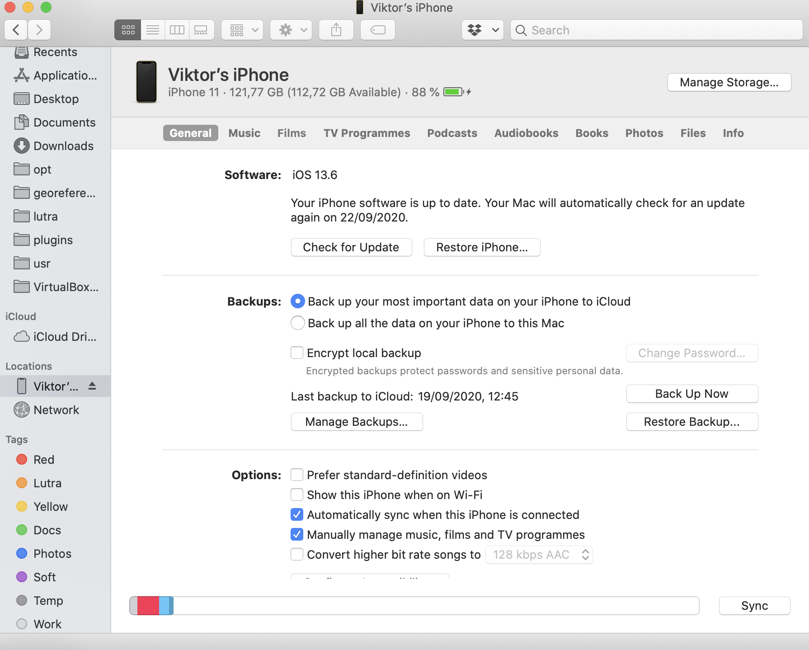
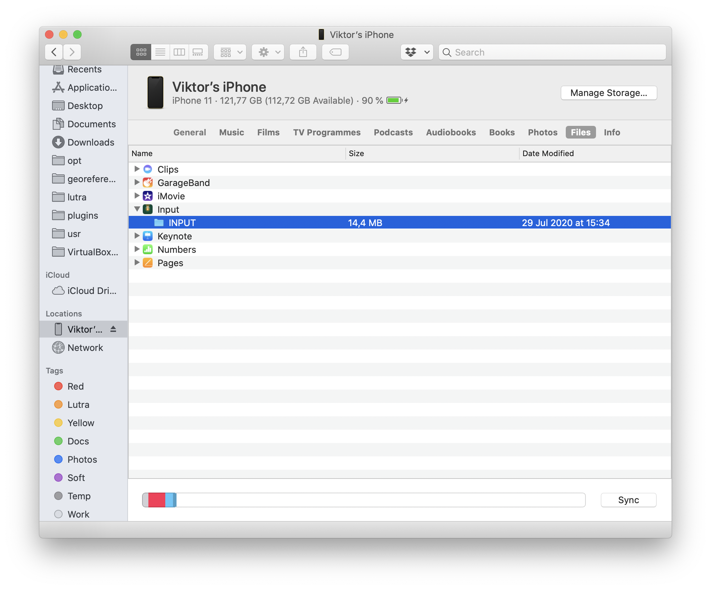

# Data/project transfer

## Using Mergin

Input comes with built-in functionality to seamlessly synchronise your
projects and data through Mergin. If you want to use this functionality,
you will need to sign up to [Mergin](https://public.cloudmergin.com) (https://public.cloudmergin.com/).

We provide a QGIS plugin for Mergin to easily synchronise your projects and data from within QGIS. See the [plugin user manual](https://github.com/lutraconsulting/qgis-mergin-plugin/blob/master/docs/user-docs.md) for more information.

​

You can also drag-and-drop your project folder (including layers, SVGs, etc)
to Mergin project webpage.

## Manual data/project transfer

### Android
This can be done by connecting your mobile device to the computer and copying data files to/from the device.
Once your Android phone or tablet is recognized by the operating system after connecting it using USB cable,
you can use file browser to copy files. On Android devices, data are stored in `INPUT/projects` directory.

### iOS
Input supports iTunes file sharing. Note that iTunes doesn't allow you to browse or edit data from the app data folder,
only allows you to delete or copy data folder to another location. Instructions to access your data are following:
* Plug iOS device to a computer
* Open `Finder` file browser
* Go to Locations -> <device_name> 
​
* Click on the tab named `files`  
​
* Select `Input` app from a list to see a data folder
* Drag-and-drop the INPUT` folder to another location to see the content