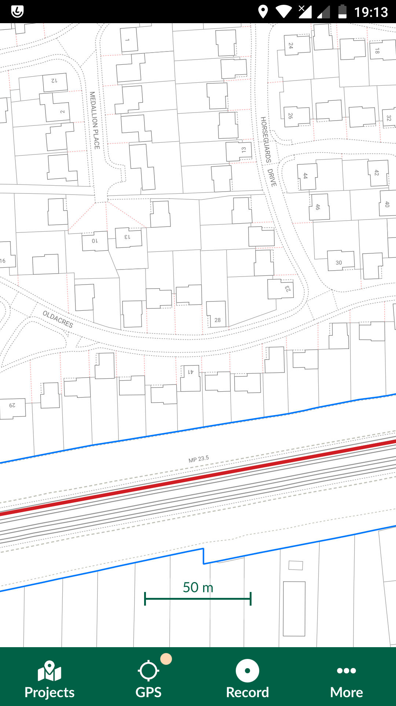
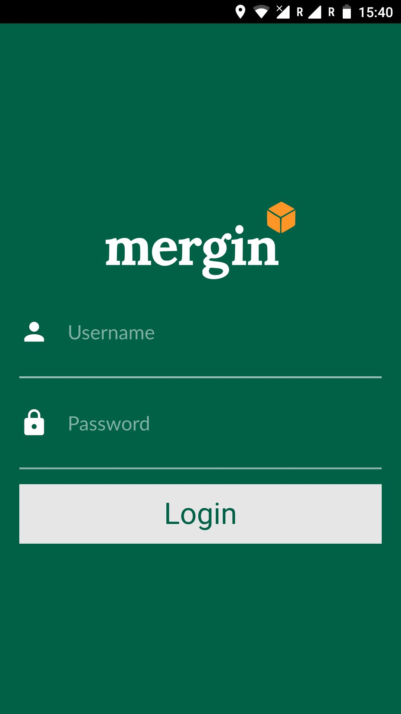
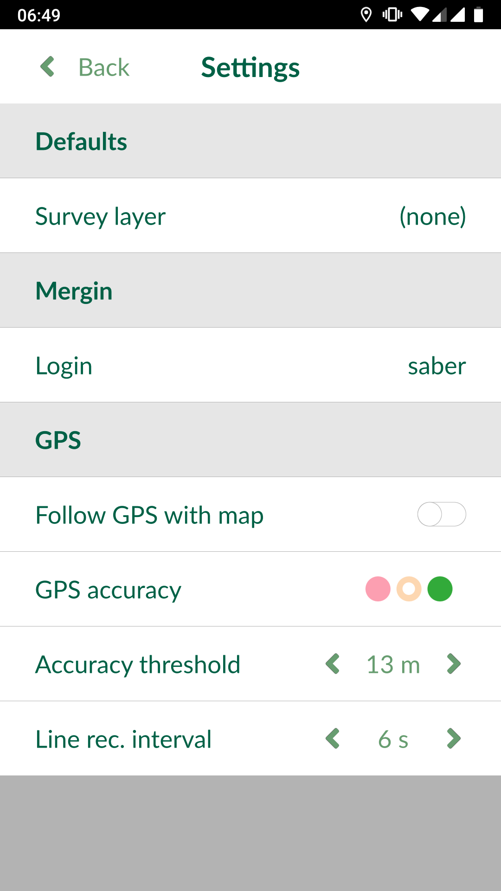

# User interface

Below is a description of various items within the user interface:

​

## Projects

Within this screen you can see the following options:
- **Home**: list of all downloaded projects on your device. You can only open downloaded projects within this screen. You can also delete local projects by selecting the bin icon to the right of each project.
- **My projects**: are the projects created by user and hosted on the Mergin service. You can download and upload changes using the icons to the right of each project.
- **Shared with me**: are projects on the Mergin service shared with you by other users.
- **Explore**: a full list of public projects by others on the Mergin service

You can **Search** for projects using the search bar on the top. To access your Mergin profile information, select the icon on the top right of this screen.

​

## GPS
By default, the map centred around the project extent. Pressing
and holding GPS icon, will turn on the GPS auto-centre mode.

GPS signal colour on the map denotes the accuracy threshold set by user
within the Input settings (See Settings section).

## Record
This option will allow user to capture the position of the GPS and save it
as point or line vertices. Pressing the **Record**  button will
list all the survey layers (point and line layers within the project not
marked as read-only in the QGIS project properties). User can then
select a layer.

If a point layer is selected, a point geometry will be recorded at the
location of the GPS. A form (attribute table) for the point will appear
for user to fill in.

If a line layer is selected, a path will be generated from the GPS track
until the record button is pressed again. The form for the recorded line
will appear accordingly.

Pressing and holding **Record** button will allow you to set the default survey layer. This option is also available under the **Settings** section.

## Zoom to project
This is a shortcut to zoom the extent of all visible layers within the project.

## Map themes
Themes generated from QGIS project will be listed here. User can switch
between different map themes using this option.

## Settings
Input specific configuration can be accessed through settings.

​

### Mergin

Displays the current user signed in to Mergin. To clear the log in,
users can tap on their name.

### GPS

**Follow GPS with map** will pan the map so the GPS point can be seen on the
map.

**GPS accuracy** colours show the current strength of the signal based on the
Accuracy threshold. If the signal falls within the the threshold, the
colour will be green. If it is outside, it will be orange. The indicator
will be red in case there is no GPS position fix available.

**Line rec. interval** when streaming GPS position for capturing lines, you can set the intervals at which the GPS location will be used as vertices of the line.
