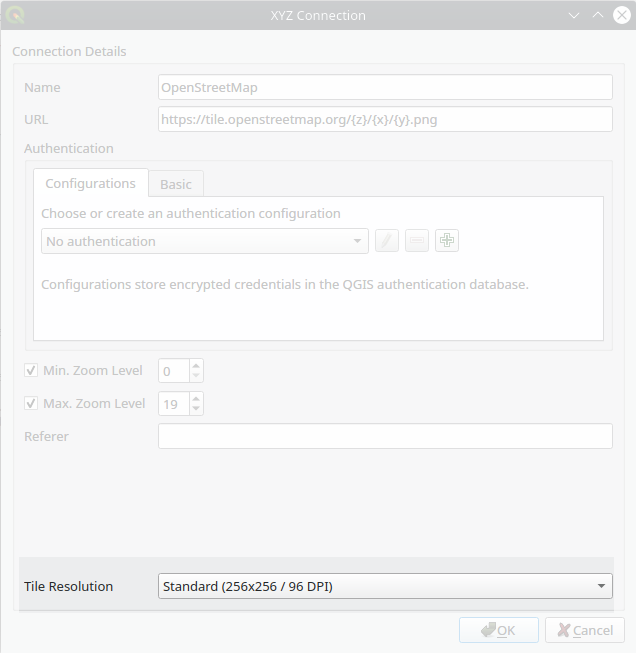
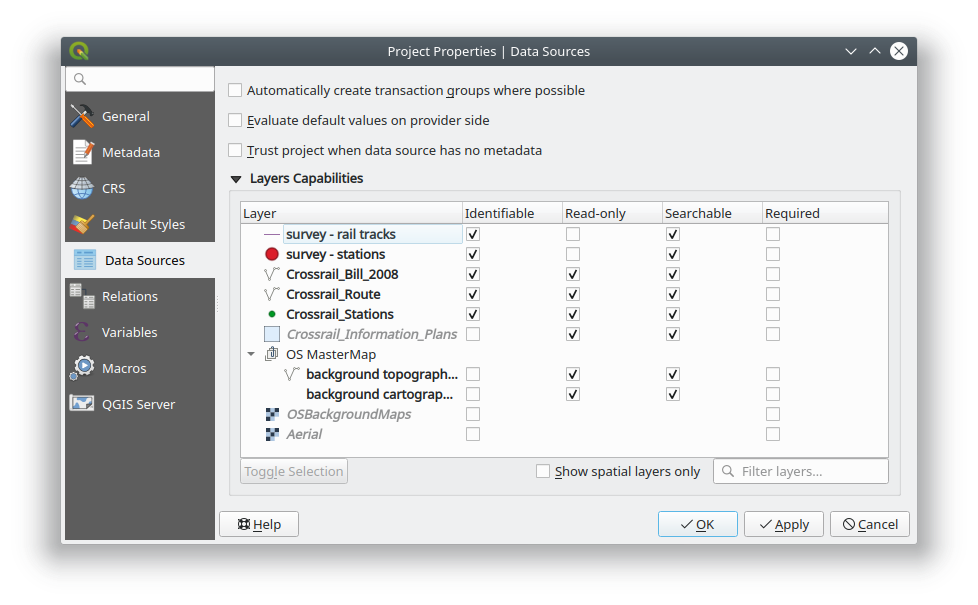

# Preparing project


Project preparation is done in QGIS. For more information about loading
layers, styling the data and creating map themes, visit QGIS
documentation page. In addition, Input uses some of the features within
the project to help with visualisation, data capturing and interrogation
of the data. Below are the key parts used by Input:

## Background layers

If you have internet connectivity, you can use a WM(T)S or XYZ layer as
your background map. QGIS can also reads local XYZ tiles.

**Note:** that for XYZ tiles, ensure to change the tile resolution to Standard in your connection settings in QGIS. This will ensure the fonts are readable on the high resolution screens (applicable to the majority of the recent phones which come with high DPI screens).

​

**Note:** you also need to change resampling method for WM(T)S layer to ensure the texts are readable on HiDPi screens.

If you are using a vector layer for background layer:

-   Ensure to use a simplified geometry version of your data. This will help with smooth map navigation.

-   All vector layers not intended to be used as survey layers, have to be set as read-only. To make a vector layer read-only in QGIS, from the main menu select Project \> Properties. Within the window, select Data Source tab and select the Read-only option for the layers you do not want to be used as survey layer in Input.

## Project extent
In Input app, there is an option to zoom to the project extent. If not set, Input zooms to all visible layers. This is not particularly convenient when you have a layer with a large/global extent (e.g. Open Street Map).

To set the project extent: from **Project** > **Properties**, select **QGIS Server** (not the most obvious location!). Under **WMS capabilities** select the option for **Advertised extent** and either enter the coordinate extent of your project bounding box or use the canvas extent.

## Survey layer

Vector layers can be used as survey layer
in Input. You can apply style and set up the forms according to the QGIS
documentation.

## Layer properties
The following properties of a layer in QGIS project will be additionally used in Input:

### Settings for Input preview panel
Similar to Google map, when a feature is identified on the map a preview panel will appear. To enable a layer being identified, the option should be enabled in QGIS desktop, under **Project properties**. For setting the preview panel, you need to open **Layer Properties** and select **Display** tab.

- title - this will use **Display Name** (in layer properties > Display tab) which can be a field name or an expression.

- content - there are three options for what to show in content area: 1. field values, 2. image, 3. HTML. This will use "HTML Map Tip" (in layer properties > Display tab). QGIS always interprets the content of map tip as being HTML, however Input extends the syntax to allow two more modes. If the map tip is not specified, Input will try to use the first three fields and show their attribute values.

#### Field values

Sample map tip content that will show "description" and "time" field values:

```
# fields
description
time
```

If the map tip content has `# fields` marker on the first line, the following lines will be understood as field names that should be listed in the preview.
At most three fields will be shown. Expressions are not allowed.

#### Image

Sample map tip content that will cause an image to be show specified by file path in field "image_1" (containing path relative to the project directory):

```
# image
file:///[%@project_folder%]/[% "image_1" %]
```

If the map tip has `# image` marker on the first line, the following line is understood as the URL for the image. It can be a regular file on the file system, but it could be even a remote image from network. Expressions embedded in the image URL will be evaluated (enclosed in `[% 1+1 %]`).

#### HTML

Sample map tip content that will show render as HTML page:

```
<p><strong>Notes:</strong>[% "notes" %]</p>
```

If the map tip does not contain any special marker, it is assumed that the map tip is HTML content. Only a limited subset of HTML is supported - see https://doc.qt.io/qt-5/richtext-html-subset.html

Example of the preview panel in Input and QGIS tooltip set up can be seen below:

​

​

### Forms
This section briefly describes behaviour of some types of widgets with several configurations.  
Make use of Value Map widget in your forms to simplify filling the forms during survey.

#### Attachement (External resource) widget
To be able to attach photos to a survey feature, you will need to have an attribute column in your survey layer. Within the form setting, ensure to set Widget type to Attachment.
The widget is compatible with field of type QString. It suppose to store absolute/relative path to an image.

##### Field configuration:
* **Widget type** - **Attachment** as the only option to work with images
* **Default path** - Defines where an image will be saved. Evaluation of `default path` configuration is in following order:
    * evaluate default path expression if defined,
    * use default path value if not empty,
    * use project home folder.
    
* **Relative path**
    * **unchecked** -  the final value of a attachment field has absolute path,
    * **relative to project path** - relative to project home folder path (where project file is located),
    * **relative to default path** - relative to defined default path. See section above if it is not defined. 


##### Examples
Lets define project home folder as 'path/to/project', where a project file is located.

|        default path       	|  relative to 	|                value               	|
|:-------------------------:	|:------------:	|:----------------------------------:	|
|             -             	|       -      	|     `<path/to/project>/image.jpg`    	|
|             -             	| project home 	|              `image.jpg`             	|
|             -             	| default path 	|              `image.jpg`             	|
|      `@project_folder`      	|       -      	|     `<path/to/project>/image.jpg`    	|
|      `@project_folder`      	| project home 	|              `image.jpg`             	|
|      `@project_folder`      	| default path 	|              `image.jpg`             	|
| `@project_home + '/photos'` 	|       -      	| `<path/to/project>/photos/image.jpg` 	|
| `@project_home + '/photos'` 	| project home 	|          `/photos/image.jpg`         	|
| `@project_home + '/photos'` 	| default path 	|              `image.jpg`             	|


#### Date/Time widget

##### Field configuration:
* **Widget type** - **Date/Time** as the only option to use a date time widget
* **Field format** - currently supported Date, DateTime, Time, Custom
* **Widget display** - supported both Default or Custom
* **Calendar popup** - currently ignored, Input datetime widget **always** acts like it is **checked**
* **Default value** - has to return a type matching QgsField type

Note that while working with QString fields with a date/time value and format function (used in a default value), 
it is important to match field format with a given format there.

###QgsField type
How the result value is saved depends on how a QgsField is defined. Following types are supported:

Default values are marked as "**-**"
####Type: QString
|         field format         	|    widget display   	|               default value               	|        value       	|
|:----------------------------:	|:-------------------:	|:-----------------------------------------:	|:-------------------:	|
|             Date             	|          -          	|      `format_date(now(), 'yyyy-MM-dd')`     	|      `''2020-09-09'`     	|
|      Custom (dd/MM/yyyy)     	|      dd/MM/yyyy     	|      `format_date(now(), 'dd/MM/yyyy')`     	|      `'09/09/2020'`     	|
|             Time             	|          -          	|       `format_date(now(), 'HH:mm:ss')`      	|       `'12:34:56'`      	|
|       Custom (HH-mm-ss)      	|       HH-mm-ss      	|       `format_date(now(), 'HH-mm-ss')`      	|       `'12-34-56'`      	|
|           Date Time          	|          -          	| `format_date(now(), 'yyyy-MM-dd HH:mm:ss')` 	| `'2020-09-09 12:34:56'` 	|
| Custom (dd/MM/yyyy HH-mm-ss) 	| dd/MM/yyyy HH-mm-ss 	| `format_date(now(), 'dd/MM/yyyy HH-mm-ss')` 	| `'09/09/2020 12-34-56'` 	|
####Type: QDate
| field format 	| widget display 	| default value 	|   value   	|
|:------------:	|:--------------:	|:-------------:	|:----------:	|
|     Date     	|        -       	|       -       	| `0000-00-00` 	|
|     Date     	|        -       	|     `now()`     	| `2020-09-09` 	|
|     Date     	|   dd/MM/yyyy   	|     `now()`     	| `09/09/2020` 	|


####Type: QDateTime
| field format 	|    widget display   	| default value 	|        value       	|
|:------------:	|:-------------------:	|:-------------:	|:-------------------:	|
|     Time     	|          -          	|       -       	|       `00:00:00`      	|
|     Time     	|          -          	|     `now()`     	|       `12:34:56`      	|
|     Time     	|       HH/mm/ss      	|     `now()`     	|       `12/34/56`      	|
|   Date Time  	|          -          	|       -       	| `0000-00-00 00:00:00` 	|
|   Date Time  	|          -          	|     `now()`     	| `2020-09-09 12:34:56` 	|
|   Date Time  	| dd/MM/yyyy hh-mm-ss 	|     `now()`     	| `09/09/2020 12-34-56` 	|

## Project settings

Having Map Themes, will help switching between different background layers in Input (e.g. one map theme set up with aerial photo and another with cartography rasters.)

Ensure the paths are set to Relative under Project Properties. All paths to the project data in Input is relative to the project location.

Input does not include all the SVGs within QGIS. Therefore, if you are using SVGs for your layer styling, ensure those are copied across to the project folder.

An example of Project Properties in QGIS for survey layers and identifiable layers can be seen below:

​

## QGIS variables

Input recognizes several variables that can be used in QGIS expressions (they are also supported by Mergin plugin for QGIS):

| Variable name               | Sample value                     | Scope   | Description |
|-----------------------------|----------------------------------|---------|-------------|
| `@mergin_username`          | `martin`                         | global  | Name of the user currently logged in to Mergin |
| `@mergin_url`               | `https://public.cloudmergin.com` | global  | URL of the Mergin service |
| `@mergin_project_name`      | `Tree survey`                    | project | Name of the active Mergin project  |
| `@mergin_project_owner`     | `martin`                         | project | Name of the owner of the active Mergin project |
| `@mergin_project_full_name` | `martin/Tree survey`             | project | Owner and project name joined with a forward slash |
| `@mergin_project_version`   | `42`                             | project | Current version of the active Mergin project |

A common use case is to use `@mergin_username` as the default value for one of the fields in a survey layer to automatically track who has added (and/or modified) a particular record.
