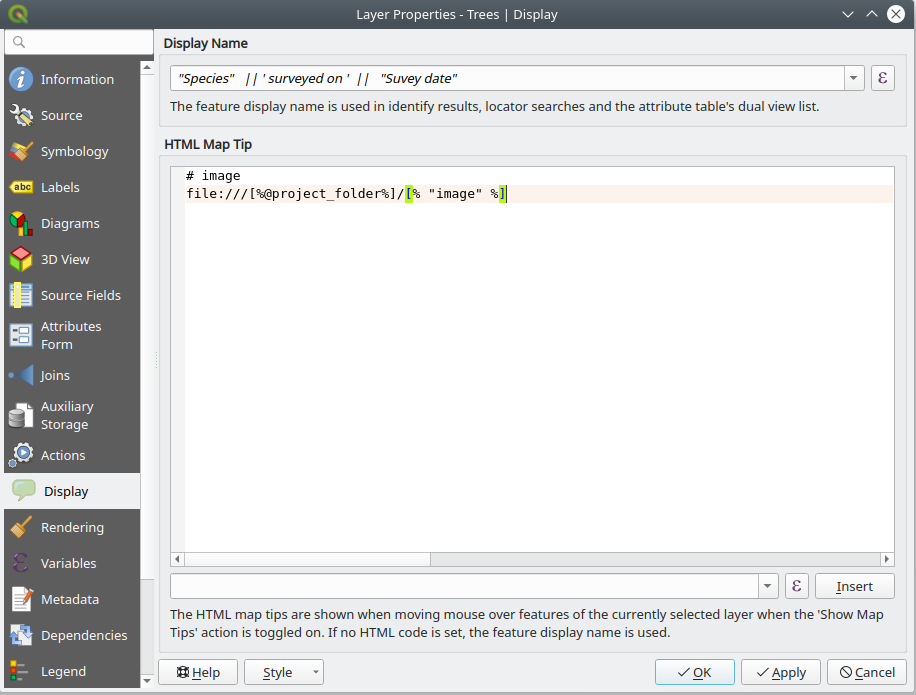
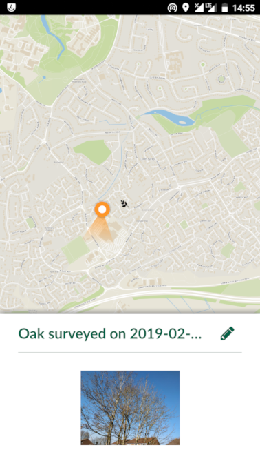

What is Input
=============

Input is a simple survey app allowing users to capture data in field.
Forms and data preparation can be done in QGIS software.

Input is not aimed to be a full GIS/mapping application. It is designed
with simplicity, ease of use and seamless data synchronisation in mind.

Typical workflow
================

A typical workflow for using Input consists of the following steps:

-   Preparing project: user loads background and survey layers, set up the forms, apply styling to the layers, set up map themes and define the layers to be used for survey purpose

-   Data/project transfer: once the project set up, users need to transfer data to the device. This can be achieved through [Mergin](https://public.cloudmergin.com).

-   Working with Input: map navigation, data editing, including filling the forms, viewing existing data and uploading the changes back to Mergin.

Preparing project
-----------------

Project preparation is done in QGIS. For more information about loading
layers, styling the data and creating map themes, visit QGIS
documentation page. In addition, Input uses some of the features within
the project to help with visualisation, data capturing and interrogation
of the data. Below are the key parts used by Input:

### Background layers

If you have internet connectivity, you can use a WM(T)S or XYZ layer as
your background map. QGIS can also reads local XYZ tiles.

If you are using a vector layer for background layer:

-   Ensure to use a simplified geometry version of your data. This will help with smooth map navigation.

-   All vector layers not intended to be used as survey layers, have to be set as read-only. To make a vector layer read-only in QGIS, from the main menu select Project \> Properties. Within the window, select Data Source tab and select the Read-only option for the layers you do not want to be used as survey layer in Input.

### Survey layer

Vector layers (currently points and lines) can be used as survey layer
in Input. You can apply style and set up the forms according to the QGIS
documentation. The following points will be additionally used in Input:

-   Input preview panel (similar to Google map) is used when you tap on
    a feature from the survey layer. You can set up a map tooltip to be displayed within the preview panel. Example of the preview panel in Input and QGIS tooltip set up can be seen below:

-   To be able to attach photos to a survey feature, you will need to have an attribute column in your survey layer. Within the form setting, ensure to set Widget type to Attachment.

-   Make use of Value Map widget in your forms to simplify filling the forms during survey.

### Project settings

-   Having Map Themes, will help switching between different background layers in Input (e.g. one map theme set up with aerial photo and another with cartography rasters.)

-   Ensure the paths are set to Relative under Project Properties.

-   Input does not include all the SVGs within QGIS. Therefore, if you are using SVGs for your layer styling, ensure those are copied across to the project folder.

-   Input currently cannot read QGZ project. Ensure to save your project as QGS file.

Data/project transfer
---------------------

Input comes with built-in functionality to seamlessly synchronise your
projects and data through Mergin. If you want to use this functionality,
you will need to sign up to [Mergin](https://public.cloudmergin.com) (https://public.cloudmergin.com/).
You can drag-and-drop your project folder (including layers, SVGs, etc)
to Mergin project page.

Working with Input
------------------

You can install Input from Google Play Store. Once you open the
application for the first time, it will take you to MY PROJECT screen.
This screen displays all the projects stored locally (under
/sdcard/INPUT folder).

{ width=50% }

To access your projects or those shared with you through Mergin, select
ALL PROJECTS tab. You will require your log in details to sign in to
Mergin:

{ width=50% }

Once logged in, you can download your project to work on it locally by
pressing download button to the right of the project:

{ width=50% }
==============================================================================

The project will be available for survey after you download it locally.
Select MY PROJECTS and you should be able to see your downloaded
project:

{ width=50% }

Selecting a project under MY PROJECTS will open it in INPUT.

To add a feature, select the record button from the lower panel. When
you tap on the record button for the first time, it will list all the
layers, you can edit. The layer you select for the first time to survey,
will become automatically, your default survey layer and subsequent
tapping on the record button, will add feature to this layer. To reset
the default survey layer, press and hold the record button. This will
reset the defaults and shows all the layers for survey.

If your survey layer is a point layer, it will record the location of
your device as the survey point. If your survey layer is a line, it will
start the path and tracks your GPS as an input to the line vertices. To
finish the line capturing, you will need to press the record button
again.

You can view the existing data by tapping on them on the map. It will
open a preview panel (according to Display settings in QGIS - see
project preparation section). To edit the form related to an existing
feature, you can press the pencil within the preview panel. If you want
to delete the item, you can press the recycle bin from the lower panel
in the form edit.

You can upload your changes through Mergin, once you have network
connectivity. Select Project from the lower panel and then tap on ALL
PROJECTS. Input should automatically flag changed projects with an
upload icon.

{ width=50% }

Pressing upload button to the right of the project will send the updated
data and project to Mergin. If a project and its data has been updated
through Mergin, you will be notified to synchronise the changes to your
local copy.

{ width=50% }

User interface
==============

Below is a description of various items within the user interface:

{ width=50% }

Projects
--------

Projects will list the projects available locally (MY PROJECTS) and
those shared via Mergin (ALL PROJECTS). Within MY PROJECT, user can
delete an existing project.

ALL PROJECTS lists the projects within user's Mergin account. It also
includes projects shared with the user by other Mergin users. Projects
can be downloaded or updated (to or from) Mergin from this screen.

GPS
---

By default, the map is always centred around the GPS signal. This will
limit to users to pan the map to the other parts of projects. Pressing
and holding GPS icon, will turn off the auto-centre mode.

GPS signal color on the map denotes the accuracy threshold set by user
within the Input settings (See Settings section).

Record
------

This option will allow user to capture the poison of the GPS and save it
as point or line. Pressing the Record button for the first time will
list all the survey layers (point and line layers within the project not
marked as read-only in the QGIS project properties). User can then
select a layer.

If a point layer is selected, a point geometry will be recorded at the
location of the GPS. A form (attribute table) for the point will appear
for user to fill in.

If a line layer is selected, a path will be generated from the GPS track
until the record button is pressed again. The form for the recorded line
will appear accordingly.

Input sets the last surveyed layer as the default layer for editing.
Subsequent pressing of the record will make changes to the default
layer. To reset the default layer and see the full list of the survey
layers, you need to press and hold the record button.

Zoom to project
---------------

This is a shortcut to zoom the extent of the layers within the project.

Map themes
----------

Themes generated from QGIS project will be listed here. User can switch
between different map themes using this option.

Settings
--------

Input comes with its own settings.

### Defaults

The default Survey layer can be viewed, cleared or reset here. By
tapping the Survey layer, you can set a layer or deselect the default
layer.

### Mergin

Displays the current user signed in to Mergin. To clear the log in,
users can tap on their name.

### GPS

Follow GPS with map will pan the map so the GPS point can be seen on the
map.

GPS accuracy colors show the current strength of the signal based on the
Accuracy threshold. If the signal falls within the the threshold, the
color will be green. If it is outside, it will be orange or red.
