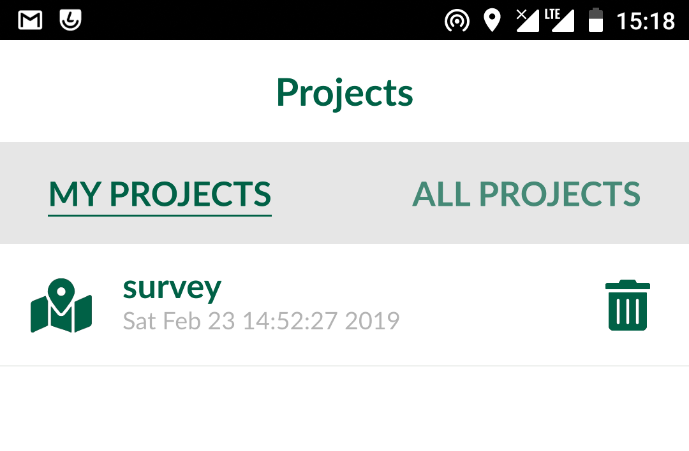
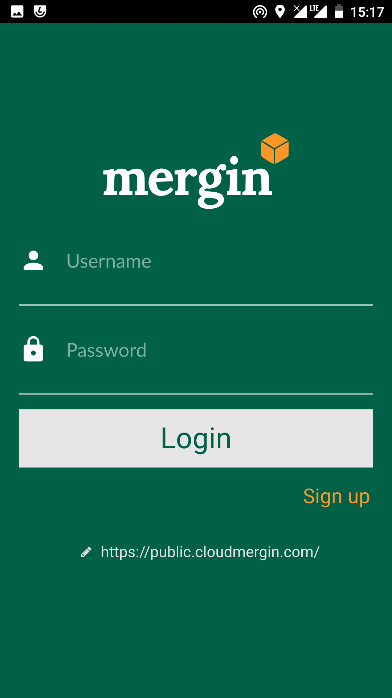
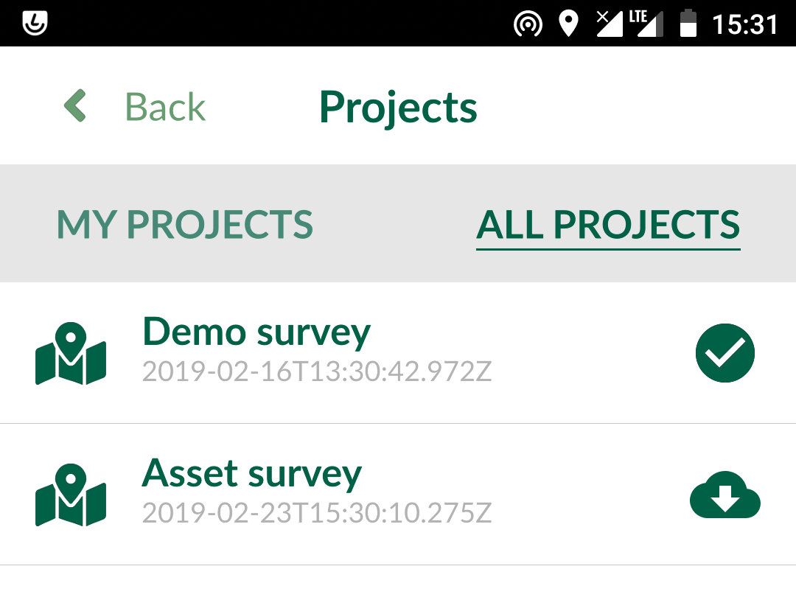
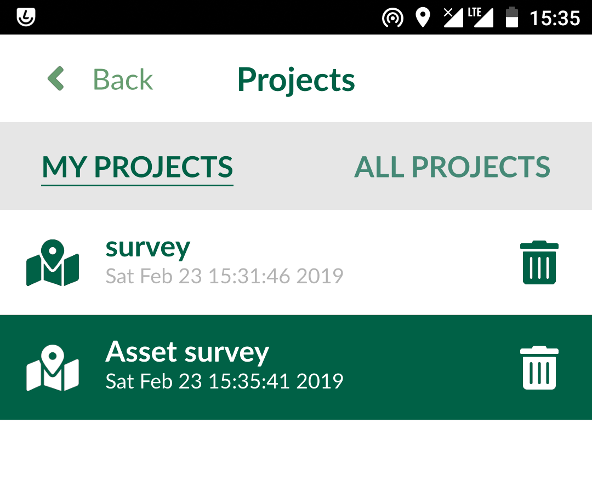
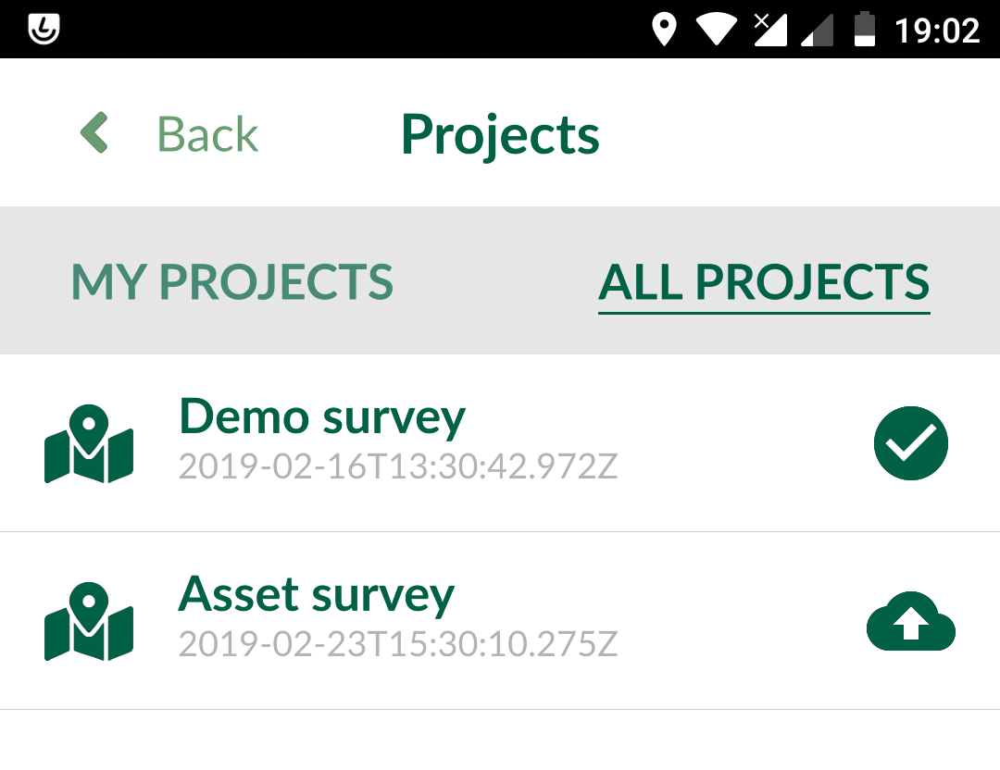
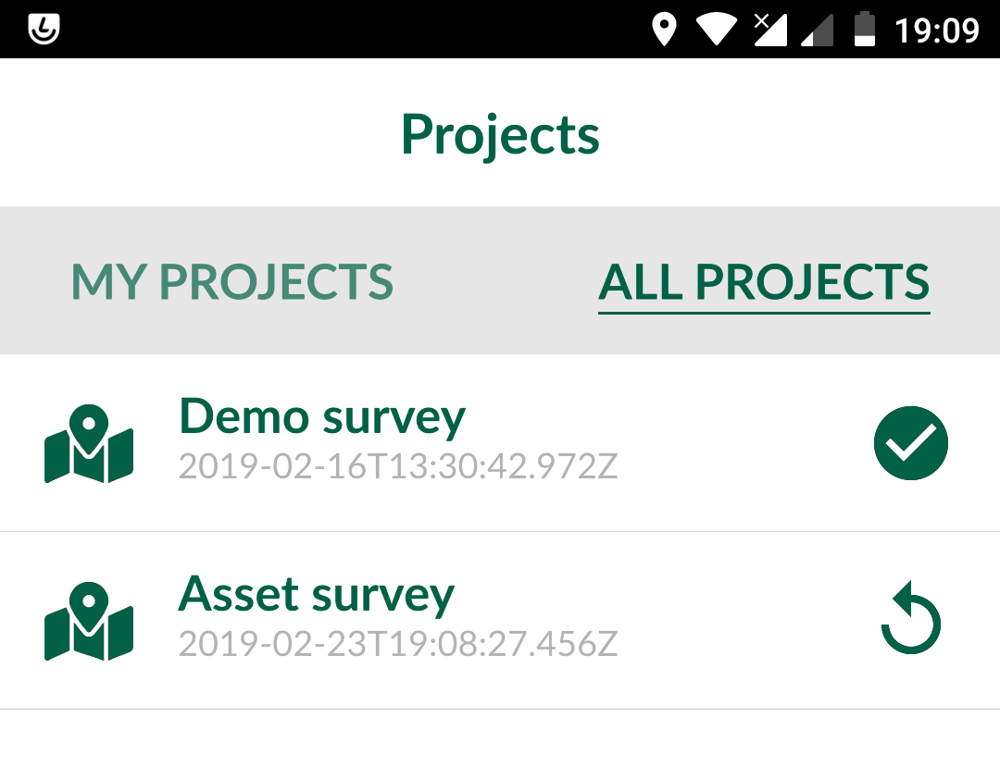

# Working with Input

## Accessing projects
You can install Input from Google Play Store. Once you open the
application for the first time, it will take you to MY PROJECTS screen.
This screen displays all the projects stored locally (under
/sdcard/INPUT folder).

​

To access your projects or those shared with you through Mergin, select
ALL PROJECTS tab. You will need your log in details to sign in to
Mergin:

​

Once logged in, you can download your project to work on it locally by
pressing download button to the right of the project:

​

The project will be available for survey after you download it locally.
Select MY PROJECTS and you should be able to see your downloaded
project:

​

Selecting a project under MY PROJECTS will open it in INPUT.

## Adding/editing features

To add a feature, select the record button from the lower panel. When you tap on the record button, it will list all the
layers, you can edit.

If your survey layer is a point layer, it will record the location of
your device as the survey point. If your survey layer is a line, it will
start the path and tracks your GPS as an input to the line vertices. To
finish the line capturing, you will need to press the record button
again.

You can set the default survey layer, so when you press record, it will automatically adds the feature to the default layer. To set the default survey layer, click on **Settings** and set the survey layer under **Defaults**. Alternatively, you can press and hold **Record button** to set the default survey layer.

## Viewing/deleting existing data
You can view the existing data by tapping on them on the map. It will
open a preview panel (according to Display settings in QGIS - see
project preparation section). To edit the form related to an existing
feature, you can press the pencil within the preview panel. If you want
to delete the item, you can press the recycle bin from the lower panel
in the form edit.

## Synchronisation of data/ projects
You can upload your changes through Mergin, once you have network
connectivity. Select Project from the lower panel and then tap on ALL
PROJECTS. Input should automatically flag changed projects with an
upload icon.

​

Pressing upload button to the right of the project will send the updated
data and project to Mergin. If a project and its data has been updated
through Mergin, you will be notified to synchronise the changes to your
local copy.

​
