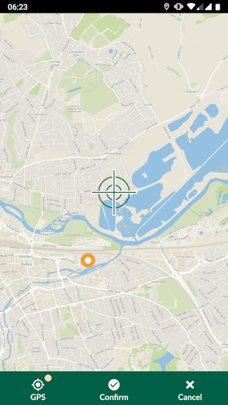
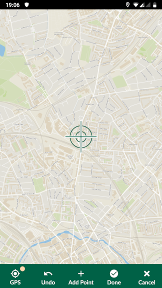

# Working with Input

## Accessing projects
You can install Input from Google Play Store. Once you open the
application for the first time, it will take you to MY PROJECTS screen.
This screen displays all the projects stored locally (under
/sdcard/INPUT folder).

​

To access your projects or those shared with you through Mergin, select
ALL PROJECTS tab. You will need your log in details to sign in to
Mergin:

​

Once logged in, you can download your project to work on it locally by
pressing download button to the right of the project:

​

The project will be available for survey after you download it locally.
Select MY PROJECTS and you should be able to see your downloaded
project:

​

Selecting a project under MY PROJECTS will open it in INPUT.

## Adding/editing features

To add a feature, select the record button from the lower panel. When you tap on the record button, it will list all the
layers, you can edit. In Input, you have two modes to capture feature:

  - GPS location or streaming (if you are capturing lines/areas)

  - Free hand: by adding points or nodes to lines or areas

### Capturing points

If your survey layer is a point layer, it will show a cross-hair at your GPS location. You can confirm the location by pressing **Confirm**. Alternatively, you can move the map to another location. The point below the cross-hair will be used as the recorded location. You can move back to your location, by pressing **GPS**.

​

### Capturing lines or areas

If your survey layer is a line or area, the panel at the bottom changes to a figure similar to the one below:

​

You can:

- Use **Add point** to define the shape of your line or area manually by navigating through the map

- If you want to **stream** the GPS to shape your line or area, press and hold **GPS** button on the bottom left corner.

Once finished, press **Done**. If your feature is an area, it will join the last point to the first point to close the shape.

You can set the default survey layer, so that when you press record, it will automatically adds the feature to the default layer. To set the default survey layer, click on **Settings** and set the survey layer under **Defaults**. Alternatively, you can press and hold **Record button** to set the default survey layer.

## Viewing/deleting existing data
You can view the existing data by tapping on them on the map. It will
open a preview panel (according to Display settings in QGIS - see
project preparation section). To edit the form related to an existing
feature, you can press the pencil within the preview panel.

For point layers, you can also change the location (geometry) of your layer, by pressing **Edit geometry**. Similar to capturing a new point, a map will appear with a cross-hair at your GPS location. You can adjust the location of the cross-hair by panning the map and press **Confirm**.

If you want to delete the item, you can press the recycle bin from the lower panel
in the form edit.

## Synchronisation of data/ projects
You can upload your changes through Mergin, once you have network
connectivity. Select Project from the lower panel and then tap on ALL
PROJECTS. Input should automatically flag changed projects with an
upload icon.

​

Pressing upload button to the right of the project will send the updated
data and project to Mergin. If a project and its data has been updated
through Mergin, you will be notified to synchronise the changes to your
local copy.

​
